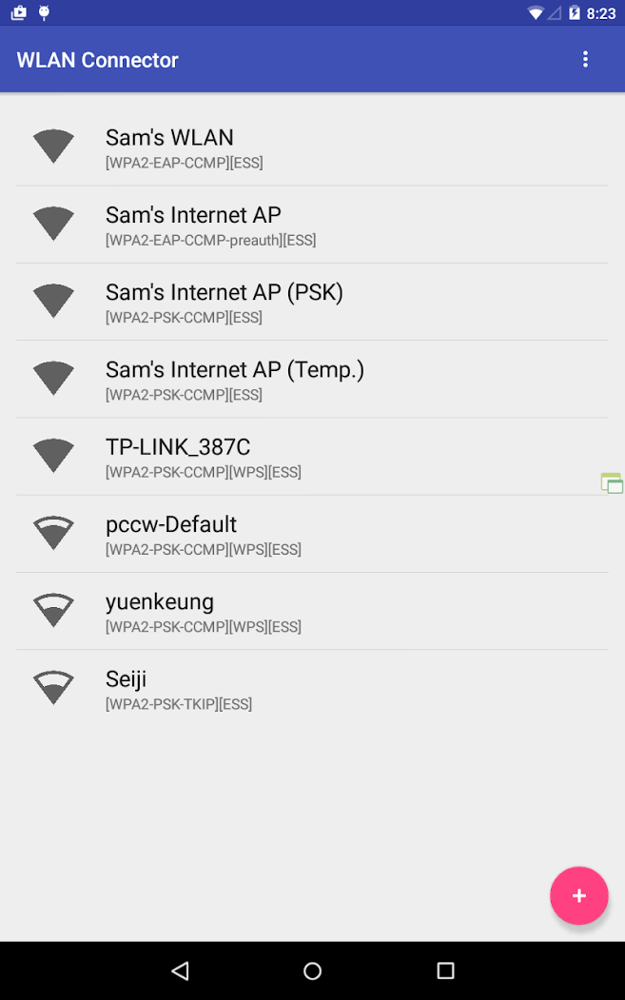
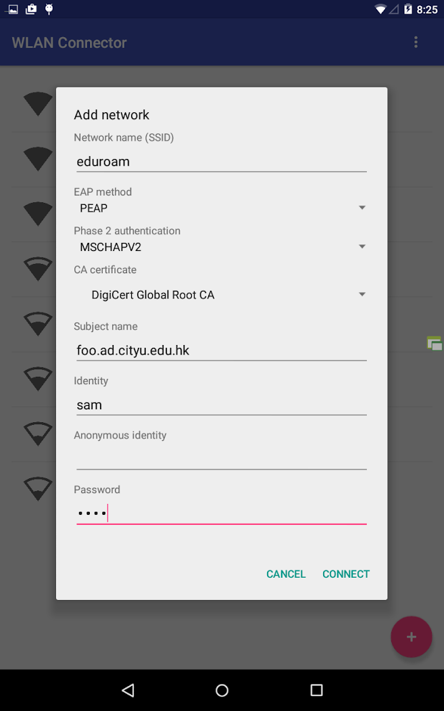

Although there is an API to validate the identity of radius servers from Android 4.3, this feature is not implemented in the built-in Wi-Fi user interface until Android 7. This app provides a way to setup a secure connection between your phone and Wi-Fi access points that authenticate with WPA2-Enterprise.

## Features
* Connect to Wi-Fi access points with EAP-PEAP
* Require your android devices to validate server identity by checking server's certificate

## This app can not
* Connect to Wi-Fi access points with pre-shared key
* Use EAP methods other than PEAP

## Permission
* ACCESS_COARSE_LOCATION - Applications need this permission to access Wi-Fi scan results on devices running Android 6 or above.

## Screenshots

